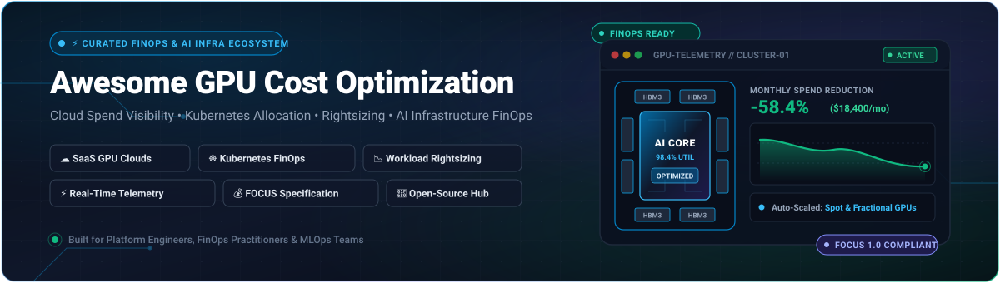

  

# Awesome GPU Cost Optimization

  
  
  

## 🌟 Top GPU Cost Optimization Tools Ecosystem

**Curated List of SaaS Products & Open-Source GitHub Projects**

*Focused on GPU Cloud Cost Visibility, Allocation, Rightsizing, FinOps, Machine Learning Infrastructure, and AI Infrastructure Spend Management*

**Last updated:** August 2026

This repository tracks notable **SaaS platforms** and **open-source projects** for **GPU Cost Optimization**. These tools provide visibility into GPU spend across cloud providers and Kubernetes clusters, enable cost allocation by workload/namespace, surface idle resources, support rightsizing/autoscaling, and help teams control AI/ML infrastructure costs.

**Examples** include Cast AI, Run:AI, Zesty, TensorDock, CoreWeave Cost Explorer, Nebius Cost Analytics, Fluidstack Cost Insights, Crusoe Cost Manager, RunPod Billing, and Modal Usage Analytics (the category leaders).

**Open-source emphasis**: This section is heavily expanded with every major active project for self-hosting, Kubernetes cost allocation (including GPU), multi-cloud FinOps, and open cost-monitoring stacks — ideal for platform teams, FinOps practitioners, ML engineers, and organizations seeking transparent control over GPU and AI infrastructure spend.

Contributions welcome! Open a PR to add/update entries. Keep descriptions factual and link to official sites.

## 📑 Table of Contents

- [SaaS/Hosted Platforms](#saashosted-platforms)
- [Open-Source GitHub Projects](#open-source-github-projects)
- [How to Contribute](#how-to-contribute)
- [Disclaimer](#disclaimer)

## ☁️ SaaS/Hosted Platforms

| Product | Description | Pricing | Free tier limit | Company Size |
|---|---|---|---|---|
| **[Nebius Cost Analytics](https://nebius.com/)** | Cost monitoring and analytics features in the Nebius AI cloud platform for tracking GPU and AI infrastructure spend. | Pay-as-you-go with a typical $25 minimum deposit | Builder Program preview offers $25 credits; startup program offers up to $150,000 in credits. | ~$72 Billion (Market Cap) |
| **[CoreWeave Cost Explorer](https://www.coreweave.com/)** | Native cost visibility and analytics tools within CoreWeave’s GPU-specialized cloud for large-scale AI training and inference. | Billed per node-hour (often requires minimum 8-GPU nodes) | Trial credits of $25 to $100 available upon request for production setups. | ~$59 Billion (Valuation) |
| **[Crusoe Cost Manager](https://www.crusoeenergy.com/)** | Cost management capabilities within Crusoe’s energy-efficient GPU cloud for sustainable high-performance computing. | Billed hourly (on-demand and spot instances available) | Does not offer free tier or free trial. | >$10 Billion (Valuation) |
| **[Fluidstack Cost Insights](https://www.fluidstack.io/)** | Cost visibility and optimization insights for Fluidstack’s aggregated GPU cloud and private cluster offerings. | Billed hourly for on-demand or monthly/annual for reserved instances | Does not offer free tier or free trial. Premium enterprise platform. | ~$7.5 Billion (Valuation) |
| **[Modal Usage Analytics](https://modal.com/)** | Built-in usage tracking and cost visibility for Modal’s serverless GPU platform that bills per second of compute. | Billed per second; Team plan starts at $250/month base + compute | Starter plan provides $30 in free compute credits every month. | ~$4.65 Billion (Valuation) |
| **[Cast AI](https://cast.ai/)** | Automated Kubernetes cost optimization platform with rightsizing, autoscaling, spot instance management, and strong GPU workload support. | Starts at $0/month for monitoring, Growth plan starts at $1,000/month plus per-CPU fee | Unlimited Kubernetes clusters for cost monitoring and analysis. | ~$1 Billion+ (Valuation) |
| **[RunPod Billing](https://www.runpod.io/)** | Transparent billing and usage analytics for RunPod’s GPU cloud, community, and serverless offerings. | Billed per second for compute | Startup program provides $1,000 credit package (Starter Tier). | ~$1 Billion (Valuation) |
| **[Run:AI](https://www.run.ai/)** | AI infrastructure platform focused on GPU orchestration, fractionalization, scheduling, and utilization optimization for training and inference. | Starts at approx. $2,600 per GPU annually for a 12-month contract | Free trial available for enterprise customers upon request; no permanent free tier. | ~$700 Million (Acquisition) |
| **[Zesty](https://zesty.co/)** | Cloud cost optimization solution that automatically rightsizes and manages cloud resources, including compute and storage efficiencies. | Percentage of realized cloud cost savings, starts at $0 upfront | Free initial cost assessment and ROI projection available before commitment. | ~$117 Million+ (Funding) |
| **[TensorDock](https://tensordock.com/)** | GPU cloud marketplace with flexible instance configuration and cost-focused pricing for development and training workloads. | Starts at ~$0.12/hr for consumer GPUs, minimum $5 deposit | No permanent free tier. Discounts available for students, researchers, and FOSS projects. | Acquired |

## 💻 Open-Source GitHub Projects

| Project | Stars | Description |
|---------|-------|-------------|
| **[Infracost](https://github.com/infracost/infracost)** |  | Open-source tool that estimates cloud infrastructure costs from Terraform (and other IaC) before deployment, enabling shift-left FinOps. |
| **[Karpenter](https://github.com/aws/karpenter-provider-aws)** |  | Flexible, high-performance Kubernetes cluster autoscaler that drastically optimizes compute instances and associated cloud costs. |
| **[OpenCost](https://github.com/opencost/opencost)** |  | CNCF incubating project for real-time Kubernetes cost monitoring and allocation (CPU, memory, GPU, storage) with Prometheus integration and cloud billing support. |
| **[Cloud Custodian](https://github.com/cloud-custodian/cloud-custodian)** |  | Rules engine for cloud resource management and cost governance, supporting automated cleanup and policy enforcement across providers. |
| **[Komiser](https://github.com/tailwarden/komiser)** |  | Open-source cloud resource inventory and cost visibility tool with multi-cloud support and dashboarding. |
| **[OptScale](https://github.com/hystax/optscale)** |  | Open-source FinOps and cloud cost optimization platform supporting AWS, Azure, GCP, Alibaba, and Kubernetes with idle resource detection and recommendations. |
| **[Kepler](https://github.com/sustainable-computing-io/kepler)** |  | Kubernetes-based Efficient Power Level Exporter that provides energy and carbon metrics useful for correlating GPU power with cost. |
| **[kube-green](https://github.com/kube-green/kube-green)** |  | A Kubernetes operator that reduces CO2 emissions and costs of your clusters by suspending pods during non-working hours. |
| **[Kubecost](https://github.com/kubecost/cost-analyzer)** |  | Open-core Kubernetes cost monitoring and optimization platform (built on the same allocation engine as OpenCost) with dashboards, recommendations, and multi-cluster support. |
| **[InferCost](https://github.com/defilantech/infercost)** |  | Open-source Kubernetes operator for calculating true on-prem / self-hosted AI inference costs (amortization + electricity) with Prometheus/Grafana integration. |
| **[CostScope](https://github.com/costscope/costscope)** |  | Open FinOps data plane for FOCUS-compatible cost normalization across cloud, on-prem, GPU, and AI/LLM workloads with energy metrics. |

### 🛠️ Additional Strong Open-Source Options

- **Prometheus + Grafana** dashboards combined with node-exporter and DCGM (NVIDIA) exporters for custom GPU utilization and cost metrics.
- Community **FOCUS** specification implementations and billing normalizers.
- **CloudQuery**, **Steampipe**, and similar open inventory tools for multi-cloud resource and cost discovery.
- Many operator-based tools for idle GPU detection, spot instance automation, and namespace-level chargeback.
- Academic and community scripts for GPU marketplace price tracking and arbitrage.

**Frameworks for building custom systems**: Deploy **OpenCost** or **Kubecost** for Kubernetes/GPU allocation, feed metrics into **Prometheus + Grafana**, use **Infracost** in CI for preventive cost control, add **Kepler** for energy correlation, and layer **OptScale** or custom Python/Go services for multi-cloud and AI-specific recommendations. Local LLMs (Ollama) can assist with anomaly detection and natural-language cost reports.

## 🤝 How to Contribute

1. Fork the repo.
2. Add/edit entries in `README.md` (follow existing format).
3. Include: name, link, 1–2 sentence description, and whether it's SaaS or open-source.
4. Submit PR with a short explanation.

Star the repo if you find it useful!

## ⚠️ Disclaimer

- This is a **community-curated** list — not exhaustive and not an endorsement.
- GPU and AI infrastructure costs fluctuate rapidly with hardware availability, pricing models (on-demand, spot, reserved, serverless), and utilization patterns.
- Self-hosted open-source solutions require accurate pricing data, proper labeling/tagging, and ongoing maintenance to deliver reliable cost visibility and optimization.

## 📈 Star History

<a href="https://www.star-history.com/?repos=ishandutta2007%2FAwesome-GPU-Cost-Optimization&type=date&legend=bottom-right">
<picture>
<source media="(prefers-color-scheme: dark)" srcset="https://api.star-history.com/chart?repos=ishandutta2007/Awesome-GPU-Cost-Optimization&type=date&theme=dark&legend=bottom-right" />
<source media="(prefers-color-scheme: light)" srcset="https://api.star-history.com/chart?repos=ishandutta2007/Awesome-GPU-Cost-Optimization&type=date&legend=bottom-right" />

</picture>
</a>

---

**Made for platform engineers, FinOps teams, MLOps practitioners, AI startups, and cloud architects managing GPU spend.**

Let's make GPU cost optimization more open, accurate, and actionable.
